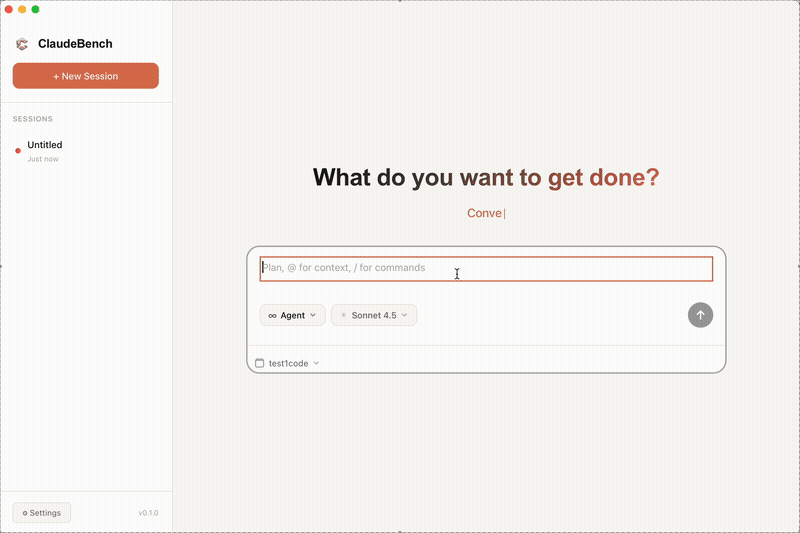

  

<h1 align="center">ClaudeBench Releases</h1>

  <strong>Official public downloads for ClaudeBench</strong> 
  Signed desktop builds, release notes, and stable release assets.

  
  
  
  

  <a href="https://claudebench.com">Website</a> |
  <a href="https://claudebench.com/download">Download</a> |
  <a href="https://claudebench.com/support">Support</a> |
  <a href="https://github.com/MJYKIM99/claudebench-releases/releases">All Releases</a>

  

---

## Overview

This repository is the official public distribution repository for ClaudeBench.

It exists to host:
- signed desktop release assets
- GitHub Release pages
- checksums and public version metadata

It does not contain the application source code. ClaudeBench is distributed as a closed-source product, so this repository is intentionally limited to public release-facing materials.

## What Is ClaudeBench

ClaudeBench is a desktop app built around Claude-powered workflows for coding, files, research, and task execution on macOS.

## Download

Latest public release:

| Version | Platform | Download |
| --- | --- | --- |
| `v0.1.9` | macOS (Apple Silicon) | [Claude_Bench_0.1.9_arm64.dmg](https://github.com/MJYKIM99/claudebench-releases/releases/download/v0.1.9/Claude_Bench_0.1.9_arm64.dmg) |

Direct release pages:

- [v0.1.9](https://github.com/MJYKIM99/claudebench-releases/releases/tag/v0.1.9)
- [v0.1.8](https://github.com/MJYKIM99/claudebench-releases/releases/tag/v0.1.8)
- [v0.1.7](https://github.com/MJYKIM99/claudebench-releases/releases/tag/v0.1.7)

## Installation

1. Download the DMG for your version.
2. Open the DMG and drag ClaudeBench into `Applications`.
3. Launch the app and complete the first-run setup.

## System Requirements

- macOS 13 or later
- Apple Silicon for current public DMG builds
- Internet connection for model and provider access

## Release History

| Version | Date | Notes |
| --- | --- | --- |
| `v0.1.9` | 2026-02-19 | Nested skill discovery and model updates |
| `v0.1.8` | 2026-02-08 | Gemini image generation and UX improvements |
| `v0.1.7` | 2026-02-08 | Cover editor enhancements |

Detailed public metadata:

- [releases/v0.1.9.json](/Users/yi/Documents/code/claudebench-releases/releases/v0.1.9.json)
- [releases/v0.1.8.json](/Users/yi/Documents/code/claudebench-releases/releases/v0.1.8.json)
- [releases/v0.1.7.json](/Users/yi/Documents/code/claudebench-releases/releases/v0.1.7.json)

## Repository Scope

Public content that belongs here:
- release notes
- signed binaries uploaded as GitHub Release assets
- checksums
- public-facing version metadata

Content that does not belong here:
- application source code
- internal tooling
- signing secrets
- private build scripts
- internal operator documentation

## Maintainer Notes

If website download URLs change, keep this repository and `claudebenchweb` aligned. Public asset URLs from GitHub Releases should be treated as stable release endpoints.
